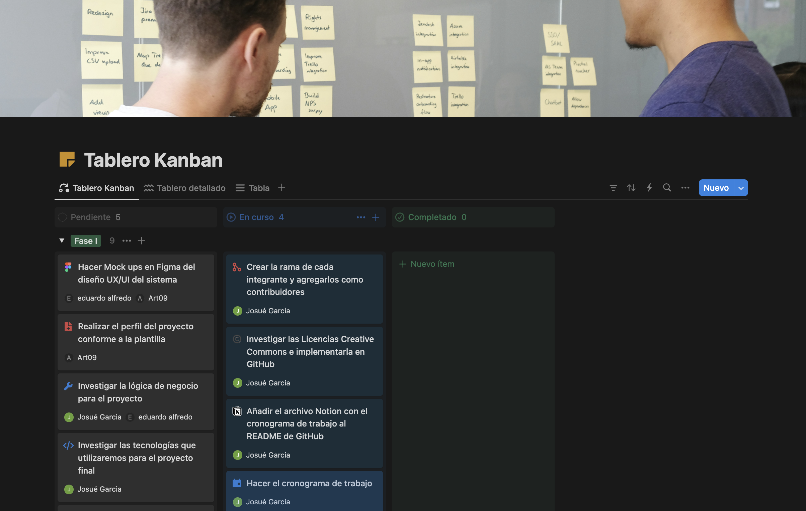
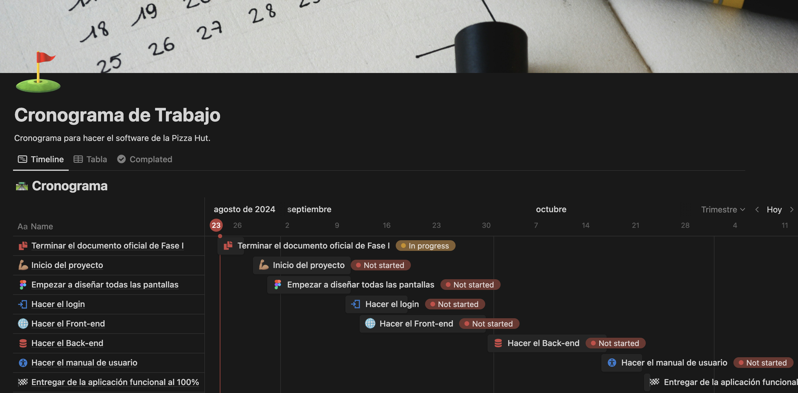

# Proyecto de Cátedra - DAW

## Descripción del proyecto
### Software de facturación para una heladería
Este software de facturación está diseñado específicamente para heladerías, facilitando la gestión de ventas, el control de inventario y la emisión de facturas de manera rápida y eficiente. Con una interfaz amigable y fácil de usar, permite ir agregando diferentes pedido a traves de lo que el cliente desee y se le va haciendo su cuenta apartir de lo que el cliente compra. Ideal para optimizar el proceso de facturación y mejorar la experiencia tanto del cliente como del negocio.

---

### Grupo Teórico
DAW - 02T
### Integrantes
1. Josué Eduardo García Estrada - **GE240098**
2. Roberto Arturo Duarte Mejía - **DMGE240115**
3. Eduardo Alfredo Ramírez Torres - **RT240549**

---

## Enlaces a los recursos de planificación del Proyecto
### Notion
1. Tablero de Kanban: [Notion](https://brazen-anemone-98f.notion.site/303fbd5e101a492f8a51437be6f0f0ec?v=f089f43b2adf405ba9120b28a00c3ca2)

2. Cronograma de Trabajo: [Notion](https://brazen-anemone-98f.notion.site/Cronograma-de-Trabajo-bb45af8612b54bbcb4bf5f985eebcb29)

### Figma 
1. Diseño de Mock ups en Figma: [Figma](https://www.figma.com/design/s5p1P9vlkDw74W6nFIKlvq/Mock-Ups-DAW?node-id=0-1&t=6m3Actf9aBI4eJ7B-1)

---

## Licencia

Este proyecto está licenciado bajo los términos de la **Attribution-NonCommercial 4.0 International (CC BY-NC 4.0)**. Puedes encontrar una copia completa en el archivo [LICENSE](./LICENSE.md) o visitar [Creative Commons](https://creativecommons.org/licenses/by-nc/4.0/legalcode) para más detalles.